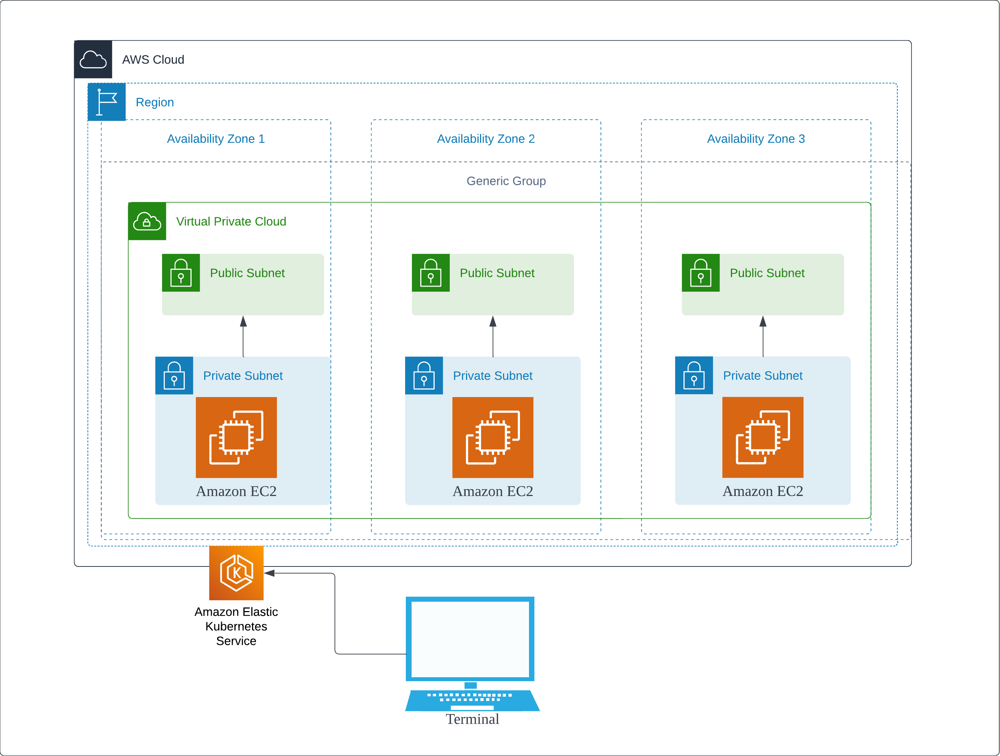

# AWS 1DC EKS

## Features

A basic setup consisting

- 1 region data center within Amazon Web Services
- A VPC with public and private subnets that span across n availability zones specified in the config
- EKS instances spanning the region's subnets

## Architecture

## Prerequisites

1. [Install terraform][1] on your local machine.
2. [Set AWS environmental variables][2].

## How to Run

1. Edit `variable.tf` to specify naming, keys, regions, zones, and cidr blocks.
2. Run `terraform apply` to execute

## Tear down

1. Run `terraform destroy`

[1]: https://developer.hashicorp.com/terraform/tutorials/aws-get-started/install-cli
[2]: https://registry.terraform.io/providers/hashicorp/aws/latest/docs#environment-variables