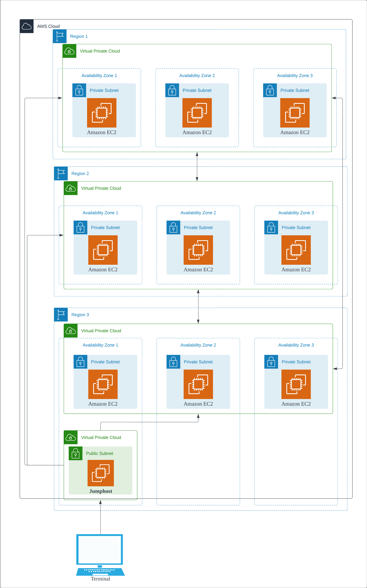

# AWS 3DC EC2

## Features

A basic setup consisting

- 3 AWS region data centers
- Each region contains a VPC with private subnets that span across availability zones
- EC2 instances are launched within each available subnet
- A jumphost VPC with an EC2 is instantiated for accessibility
- Bidirectional access (VPC Peering) between the three VPC regions
- An uni-directional access from jumphost to thre three VPCs

## Architecture

## Prerequisites

1. [Install terraform][1] on your local machine.
2. [Set AWS environmental variables][2].

## How to Run

1. Edit `variable.tf` to specify naming, keys, regions, zones, and cidr blocks.
2. Run `terraform apply` to execute

## Tear down

1. Run `terraform destroy`

[1]: https://developer.hashicorp.com/terraform/tutorials/aws-get-started/install-cli
[2]: https://registry.terraform.io/providers/hashicorp/aws/latest/docs#environment-variables